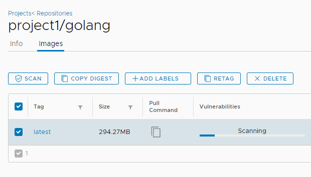
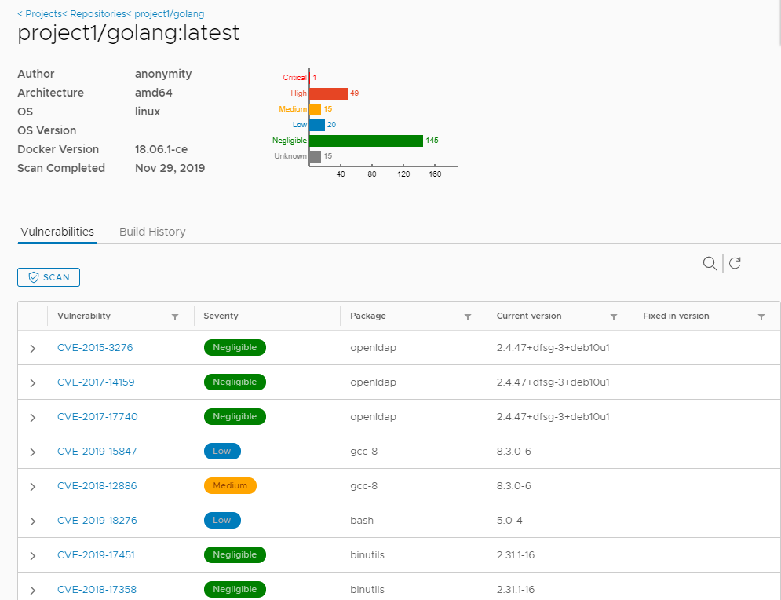

1. Log in to the Harbor interface with an account that has at least project administrator privileges.
1. Go to **Projects** and select a project. 
1. Select the **Scanner** tab.

    The **Scanner** tab shows the details of the scanner that is currently set as the scanner to use for this project.
   
    

1. Click **Edit** to select a different scanner from the list of scanners that are connected to this Harbor instance, and click **OK**.

    
   
    
    If you have selected the **Prevent vulnerable images from running** option in the project **Configuration** tab, the prevention of pulling vulnerable images is determined by the scanner that is set in the project, or by the global default scanner if no scanner is configured specifically for the project. Different scanners might apply different levels of severity to image vulnerabilities.
    

1. Select the **Repositories** tab and select a repository.

    For each tag in the repository, the **Vulnerabilities** column displays the vulnerability scanning status and related information.
   
    

1. Select a tag, or use the check box at the top to select all tags in the repository, and click the **Scan** button to run the vulnerability scan on this image.

    

    **NOTE**: You can start a scan at any time, unless the status is **Queued** or **Scanning**. If the database has not been fully populated, you should not run a scan. The following statuses are displayed in the **Vulnerabilities** column:
    
    * **Not Scanned:** The tag has never been scanned.
    * **Queued:** The scanning task is scheduled but has not run yet.
    * **Scanning:** The scanning task is in progress and a progress bar is displayed.
    * **View log:** The scanning task failed to complete. Click **View Log** link to view the related logs.
    * **Complete:** The scanning task completed successfully.

    If the process completes successfully, the result indicates the overall severity level, with the total number of vulnerabilities found for each severity level, and the number of fixable vulnerabilities.

    

    * **Red:** At least one critical vulnerability found
    * **Orange:** At least one high level vulnerability found
    * **Yellow:** At least one medium level vulnerability found
    * **Blue:** At least one low level vulnerability found
    * **Green:** No vulnerabilities found
    * **Grey:** Unknown vulnerabilities

1. Hover over the number of fixable vulnerabilities to see a summary of the vulnerability report. 

    

1. Click on the tag name to see a detailed vulnerability report.
 
    
  
    In addition to information about the tag, all of the vulnerabilities found in the last scan are listed. You can order or filter the list by the different columns. You can also click **Scan** in the report page to run a scan on this image tag.
