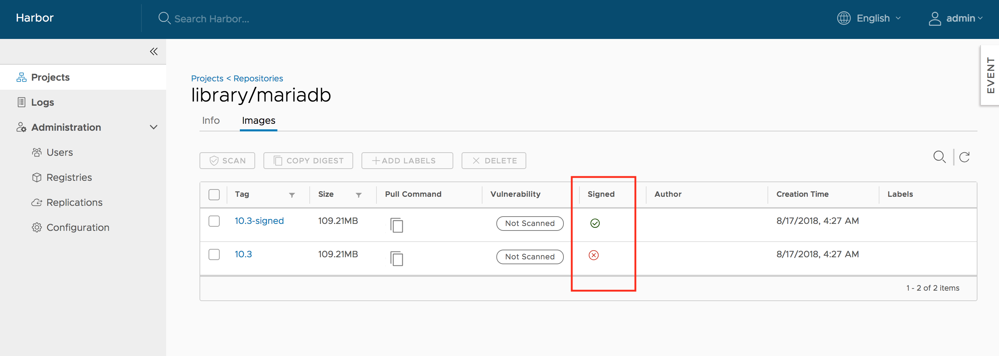


Notary is an optional component, please make sure you have already installed it in your Harbor instance before you go through this section.


If you want to enable content trust to ensure that images are signed, please set two environment variables in the command line before pushing or pulling any image:

```sh
export DOCKER_CONTENT_TRUST=1
export DOCKER_CONTENT_TRUST_SERVER=https://10.117.169.182:4443
```

If you push the image for the first time, You will be asked to enter the root key passphrase. This will be needed every time you push a new image while the `DOCKER_CONTENT_TRUST` flag is set.
The root key is generated at: `/root/.docker/trust/private/root_keys`
You will also be asked to enter a new passphrase for the image. This is generated at `/root/.docker/trust/private/tuf_keys/[registry name] /[imagepath]`.
If you are using a self-signed cert, make sure to copy the CA cert into `/etc/docker/certs.d/10.117.169.182` and `$HOME/.docker/tls/10.117.169.182:4443/`. When an image is signed, it is indicated in the Web UI.


Replace "10.117.169.182" with the IP address or domain name of your Harbor node. In order to use content trust, HTTPS must be enabled in Harbor.


When an image is signed, it has a tick shown in UI; otherwise, a cross sign(X) is displayed instead.


