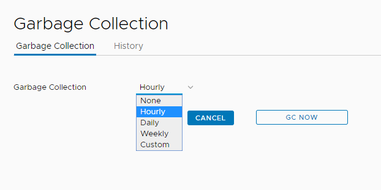
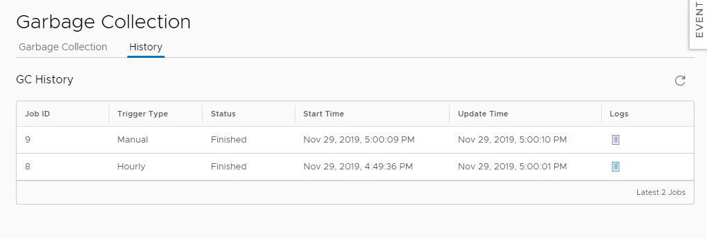

# Garbage Collection
Online Garbage Collection enables user to trigger docker registry garbage collection by clicking button on UI.

**NOTES:** The space is not freed when the images are deleted from Harbor, Garbage Collection is the task to free up the space by removing blobs from the filesystem when they are no longer referenced by a manifest.

For more information about Garbage Collection, please see [Garbage Collection](https://github.com/docker/docker.github.io/blob/master/registry/garbage-collection.md).  

### Setting up Garbage Collection
If you are a system admin, you can trigger garbage collection by clicking "GC Now" in the **'Garbage Collection'** tab of **'Configuration'** section under **'Administration'**.

**NOTES:** Harbor is put into read-only mode when to execute Garbage Collection, and any modification on docker registry is prohibited.

To avoid frequently triggering the garbage collection process, the availability of the button is restricted. It can be only triggered once in one minute.

**Scheduled Garbage Collection by Policy**
* **None:** No policy is selected.
* **Daily:** Policy is activated daily. It means an analysis job is scheduled to be executed at the specified time everyday. The scheduled job will do garbage collection in Harbor.
* **Weekly:** Policy is activated weekly. It means an analysis job is scheduled to be executed at the specified time every week. The scheduled job will do garbage collection in Harbor.
Once the policy has been configured, you have the option to save the schedule.

### Garbage Collection history
If you are a system admin, you can view the latest 10 records of garbage collection execution.

You can click on the 'details' link to view the related logs.
