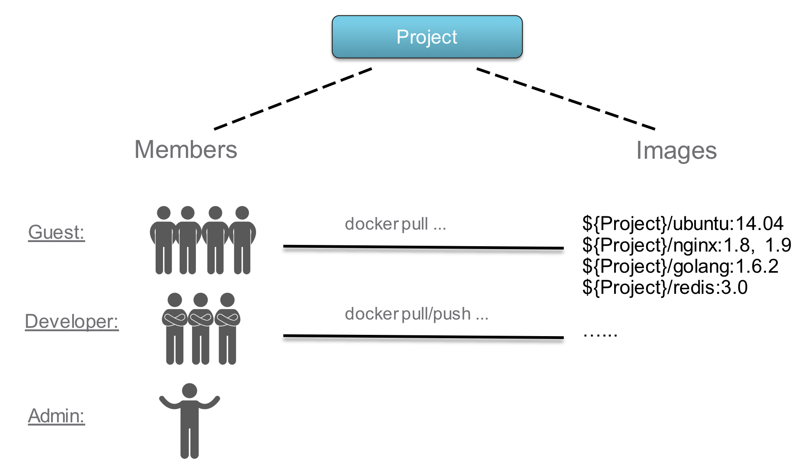

# Harbor Role Based Access Control (RBAC)  

Harbor manages images through projects. Users can be added into one project as a member with one of three different roles:  

* **Guest**: Guest has read-only privilege for a specified project.
* **Developer**: Developer has read and write privileges for a project.
* **Master**: Master has elevated permissions beyond those of 'Developer' including the ability to scan images, view replications jobs, and delete images and helm charts. 
* **ProjectAdmin**: When creating a new project, you will be assigned the "ProjectAdmin" role to the project. Besides read-write privileges, the "ProjectAdmin" also has some management privileges, such as adding and removing members, starting a vulnerability scan.

Besides the above three roles, there are two system-level roles:  

* **SysAdmin**: "SysAdmin" has the most privileges. In addition to the privileges mentioned above, "SysAdmin" can also list all projects, set an ordinary user as administrator, delete users and set vulnerability scan policy for all images. The public project "library" is also owned by the administrator.  
* **Anonymous**: When a user is not logged in, the user is considered as an "Anonymous" user. An anonymous user has no access to private projects and has read-only access to public projects.  

For full details of the permissions of the different roles, see [User Permissions By Role](user_permissions_by_role.md).

## Managing user  
Administrator can add "Administrator" role to one or more ordinary users by checking checkboxes and clicking `SET AS ADMINISTRATOR`. To delete users, checked checkboxes and select `DELETE`. Deleting user is only supported under database authentication mode.

