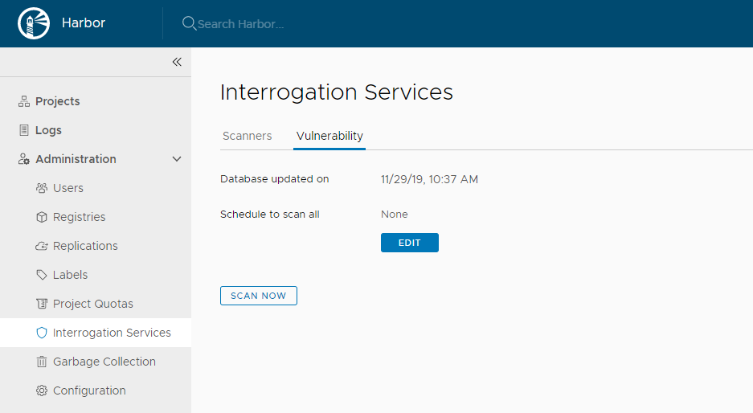

# Vulnerability Scanning

Harbor provides static analysis of vulnerabilities in images through the open source [Clair](https://github.com/coreos/clair) project. 

**IMPORTANT**: Clair is an optional component. To be able to use Clair you must have enabled Clair when you installed your Harbor instance. 

You can also connect Harbor to your own instance of Clair or to additional vulnerability scanners by using an interrogation service. You configure additional scanners in the Harbor interface, after you have installed Harbor. For the list of additional scanners that are currently supported, see the [Harbor Compatibility List](harbor_compatibility_list.md#scanner-adapters).

It might be necessary to connect Harbor to other scanners for corporate compliance reasons, or because your organization already uses a particular scanner. Different scanners also use different vulnerability databases, capture different CVE sets, and apply different severity thresholds. By connecting Harbor to more than one vulnerability scanner, you broaden the scope of your protection against vulnerabilities.

For information about installing Harbor with Clair, see the [Installation and Configuration Guide](installation_guide.md). 

You can manually initiate scanning on a particular image, or on all images in Harbor. Additionally, you can also set a policy to automatically scan all of the images at specific intervals.

- [Connect Harbor to Additional Vulnerability Scanners](pluggable_scanners.md)
- [Scan an Individual Image](scan_individual_image.md)
- [Scan All Images](scan_all_images.md)
- [Schedule Scans](schedule_scans.md)
- [Configure System-Wide CVE Whitelists](configire_system_whitelist.md)

**Vulnerability metadata** 

Vulnerability scanners depend on the vulnerability metadata to complete the analysis process. After the first initial installation, the vulnerability scanner automatically starts to update the metadata database from different vulnerability repositories. The database update might take a while, based on the data size and network connection. 

Depending on the scanner that you use, once the database is ready, the timestamp of the last update is shown in the **Interrogation Services** > **Vulnerability** tab. Currently, only Clair and Anchore provide timestamp information.

Until the database has been fully populated, the timestamp is replaced by a warning symbol. When the database is ready, you can scan images individually or scan all images across all projects.

If your Harbor instance is not connected to the external internet, you must manually update the vulnerability metadata. For information about how to update Clair manually, see [Import Vulnerability Data to an Offline Harbor instance](import_vulnerability_data.md).