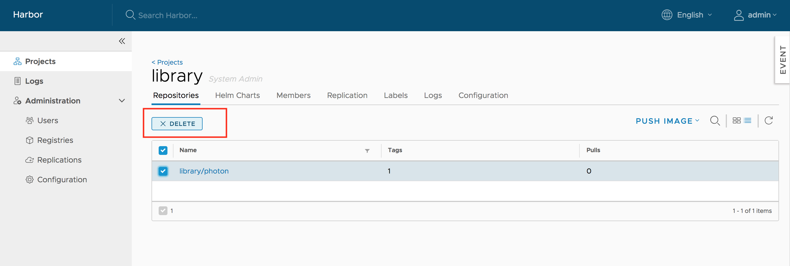

# Pulling and pushing images using Docker client  

**NOTE: Harbor only supports Registry V2 API. You need to use Docker client 1.6.0 or higher.**  

Harbor supports HTTP by default and Docker client tries to connect to Harbor using HTTPS first, so if you encounter an error as below when you pull or push images, you need to configure insecure registry. Please, read [this document](https://docs.docker.com/registry/insecure/) in order to understand how to do this. 

```Error response from daemon: Get https://myregistrydomain.com/v1/users/: dial tcp myregistrydomain.com:443 getsockopt: connection refused.```   

If this private registry supports only HTTP or HTTPS with an unknown CA certificate, please add   
`--insecure-registry myregistrydomain.com` to the daemon's start up arguments.  

In the case of HTTPS, if you have access to the registry's CA certificate, simply place the CA certificate at /etc/docker/certs.d/myregistrydomain.com/ca.crt .   

### Pulling images  
If the project that the image belongs to is private, you should sign in first:  

```sh
$ docker login 10.117.169.182  
```

You can now pull the image:  

```sh
$ docker pull 10.117.169.182/library/ubuntu:14.04  
```

**Note: Replace "10.117.169.182" with the IP address or domain name of your Harbor node. You cannot pull a unsigned image if you enabled content trust.**

### Pushing images  
Before pushing an image, you must create a corresponding project on Harbor web UI. 

First, log in from Docker client:  

```sh
$ docker login 10.117.169.182  
```

Tag the image:  

```sh
$ docker tag ubuntu:14.04 10.117.169.182/demo/ubuntu:14.04  
```

Push the image:

```sh
$ docker push 10.117.169.182/demo/ubuntu:14.04  
```

**Note: Replace "10.117.169.182" with the IP address or domain name of your Harbor node.**

###  Add description to repositories

After pushing an image, an Information can be added by project admin to describe this repository.

Go into the repository and select the "Info" tab, and click the "EDIT" button.  An textarea will appear and enter description here. Click "SAVE" button to save this information.


### Download the harbor certs

Users  can click the "registry certificate" link to download the registry certificate.


###  Deleting repositories  

Repository deletion runs in two steps.  

First, delete a repository in Harbor's UI. This is soft deletion. You can delete the entire repository or just a tag of it. After the soft deletion, 
the repository is no longer managed in Harbor, however, the files of the repository still remain in Harbor's storage.  




**CAUTION: If both tag A and tag B refer to the same image, after deleting tag A, B will also get deleted. if you enabled content trust, you need to use notary command line tool to delete the tag's signature before you delete an image.**  

Next, delete the actual files of the repository using the [garbage collection](#online-garbage-collection) in Harbor's UI. 

## Pull image from Harbor in Kubernetes
Kubernetes users can easily deploy pods with images stored in Harbor.  The settings are similar to that of another private registry.  There are two major issues:

1. When your Harbor instance is hosting http and the certificate is self signed.  You need to modify daemon.json on each work node of your cluster, for details please refer to: https://docs.docker.com/registry/insecure/#deploy-a-plain-http-registry
2. If your pod references an image under private project, you need to create a secret with the credentials of user who has permission to pull image from this project, for details refer to: https://kubernetes.io/docs/tasks/configure-pod-container/pull-image-private-registry/